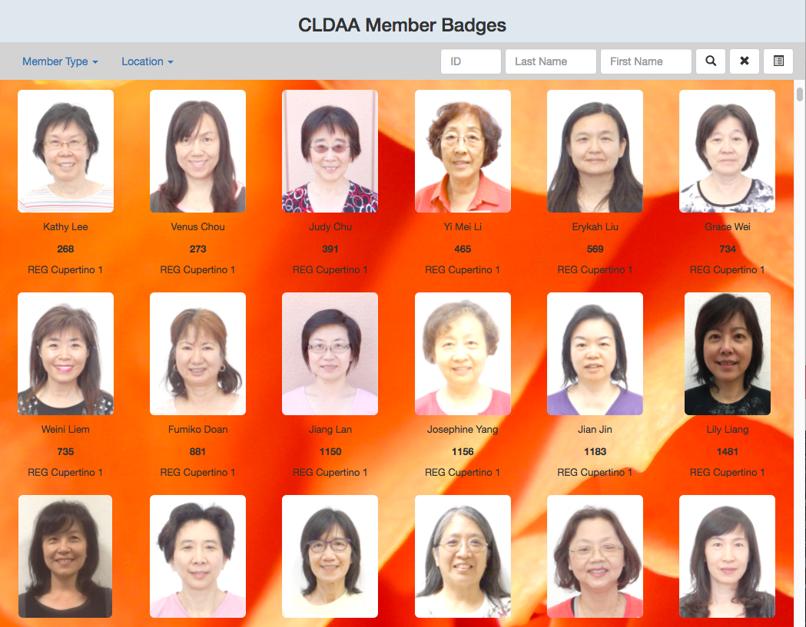

This tool allows user to view and search member photos to be used on their badges.

The membership badge contains last name, first name, member ID, location
information and photo.

A sample page here.

    

